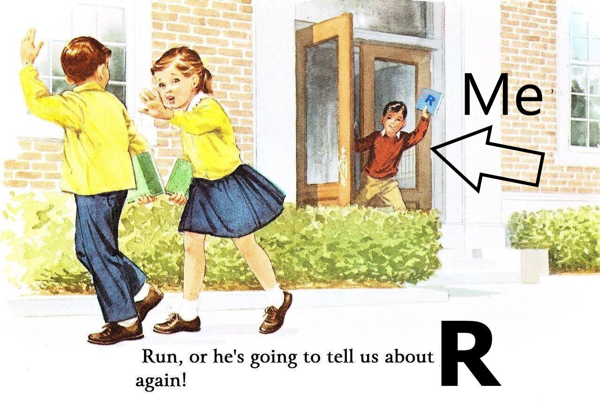
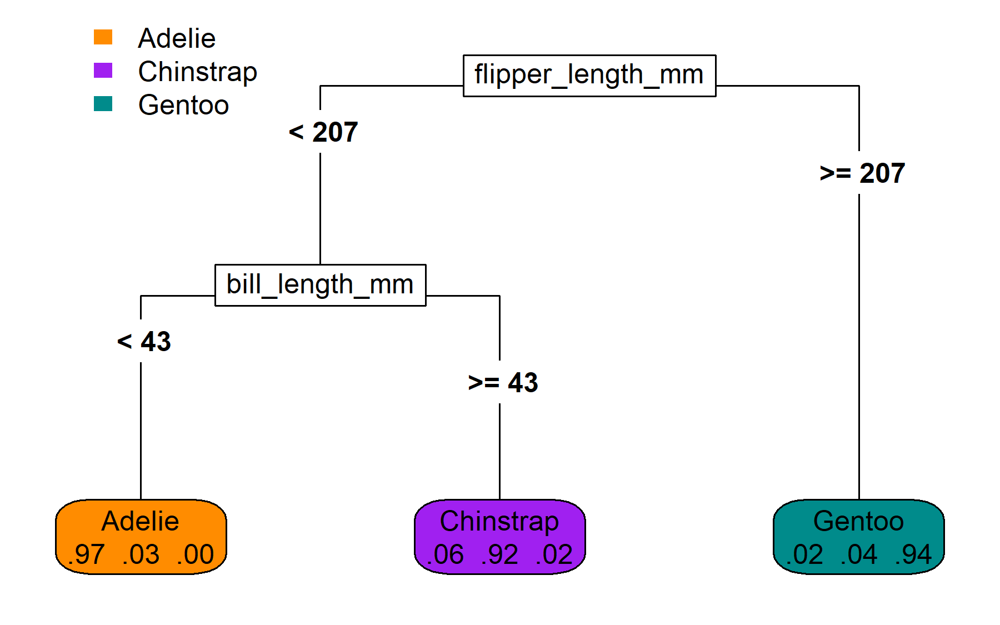

```{r setup, include=FALSE}

options(htmltools.dir.version = FALSE)

knitr::opts_chunk$set(
  echo=FALSE,
  warning = FALSE,
  message = FALSE,
  fig.width=12, 
  fig.height=5.5, 
  dpi=72*5,
  cache = FALSE
)

library(diagram)
library(MASS)
library(tidymodels)
library(survival)
library(gam)
library(glue)
library(gridExtra)
library(knitr)
library(kableExtra)
library(scales)
library(widgetframe)
library(magrittr)
library(pec)
library(tidyverse)
library(plotly)

thm  <- theme_bw() + 
  theme(
    text = element_text(size=18, face = 'bold'),
    panel.grid = element_blank()
  )

theme_set(thm)

print_plotly <- function(x){
 
 x %>% 
  layout(
   xaxis = list(range = list(-3.1, 3.1),
                showgrid = FALSE,
                zerolinecolor = 'white',
                titlefont = list(size = 20),
                title = '<b>Bill length, scaled</b>',
                tickvals = list(-3, -2, -1, 0, 1, 2, 3)),
   yaxis = list(range = list(-2.1, 2.1),
                showgrid = FALSE,
                zerolinecolor = 'white',
                titlefont = list(size = 20),
                title = '<b>Bill depth, scaled</b>',
                tickvals = list(-2, -1, 0, 1, 2))
  ) %>% 
  config(displayModeBar = FALSE) %>% 
  style(hoverinfo = 'none') %>% 
  hide_legend()
 
}

plotly_height <- 450
plotly_width <- 750
cols <- c("darkorange", "purple", "cyan4")

```


# Hello! My name is Byron 

.left-column[

I like running, walking my dog, easy cocktail recipes, all kinds of games, and R.

I study machine learning, blood pressure, and cardiovascular disease.

I'm a biostatistician and data scientist

]

.right-column[



]

---

# Outline

- **Machine Learning**

- Evaluating Survival Predictions

- Random Survival Forests

- Examples

---
background-image: url(img/data_mining.jpg)
background-size: 15%
background-position: 95% 5%

# Machine Learning

.pull-left[

### Supervised learning

- Labeled data

- Predict an outcome

- Learners

- Risk prediction

]

.pull-right[

### Unsupervised learning

- Unlabeled data

- Find structure

- Clusters

- Organize medical records

]


---
background-image: url(img/data_mining.jpg)
background-size: 15%
background-position: 95% 5%

# Machine Learning

.pull-left[

### Supervised learning

- Estimate a prediction function

- Test performance

- Improve decision-making (individual)

]

.pull-right[

### Inference

- Estimate parameters for a population.

- Test hypotheses

- Improve decision-making (population)

]

---
class: center

# Jargon (data)

```{r, out.width='100%'}

```


---
class: center

# Jargon (data)

```{r, out.width='100%'}

```


---
class: center, middle, inverse

# Bias-variance tradeoff

---
layout: true
background-image: url(img/esl.jpg)
background-position: 96% 4%
background-size: 18%

# Bias-variance tradeoff

*Definitions*

- **Bias:** how well does a model predict its training sample?

- **Variance:** how different would a model be if it were fit to a different training sample?

---

```{r}

# use loops b/c map and model environments have conflicts

results_example_1 <- list()

nsubs <- 25

for(j in 1:3){
  
  set.seed(j)
  
  x <- runif(nsubs, 0, 10)
  
  ggdat <- data.frame(y = x * (3 + sin(pi * x / 3)) + rnorm(nsubs, sd = x), 
                      x = x)
  
   fig <- ggplot(ggdat, aes(x = x, y = y)) + 
    geom_point(size = 3) +
    labs(x = 'X-value', 
         y = 'Y-value') + 
    scale_y_continuous(limits = c(0,50)) +
    scale_x_continuous(limits = c(0, 10))
  
  models <- predictions <- fig_lines <- vector(mode = 'list', length = 6)
  
  .spar <- seq(1, 0.4, length.out = 5)
  
  xgrid <- seq(min(x), max(x), length.out = 100)
  
  truth <- data.frame(x = xgrid) %>% 
    mutate(y = x * (3 + sin(pi * x / 3)))

  for(i in seq_along(.spar)){
    
    models[[i]] <- gam(y ~ s(x, spar = .spar[i]), data = ggdat)
    predictions[[i]] <- data.frame(x = truth$x, 
                                   y = predict(models[[i]], 
                                               newdata = truth))
    
    fig_lines[[i]] <- fig + 
      geom_line(data = predictions[[i]], 
                color = 'purple', 
                linewidth = 1.2)
  
    
  }
  
  models[[i+1]] <- lm(y ~ x, data = ggdat)
  
  predictions[[i+1]] <- data.frame(x = truth$x, 
                                   y = predict(models[[i+1]], 
                                               newdata = truth))
  
  fig_lines[[i+1]] <- fig + 
      geom_line(data = predictions[[i+1]], 
                color = 'orange', 
                linewidth = 1.2)
  
  fig_both <- fig_lines[[i+1]] + 
    geom_line(data = predictions[[i]], 
                color = 'purple', 
                linewidth = 1.2)
  
  
  results_example_1[[j]] <- list(data = ggdat,
                       models = models,
                       predictions = predictions,
                       figure = fig,
                       figure_lines = fig_lines,
                       figure_both = fig_both)
  
}

my_data = truth %>% 
  mutate(y = y + rnorm(length(xgrid), sd = xgrid)) %>% 
  as_tibble()

```


--

```{r}

results_example_1[[1]]$figure + 
  labs(title = 'Simulated training data (first set):')

```

---

```{r}

results_example_1[[2]]$figure + 
  labs(title = 'Simulated training data (second set):')

```

---

```{r}

results_example_1[[3]]$figure + 
  labs(title = 'Simulated training data (third set):')

```

---
layout: true
background-image: url(img/esl.jpg)
background-position: 96% 4%
background-size: 18%

# Bias-variance tradeoff

*Models*

- High bias low variance: `lm(y ~ x)` (orange line)

- Low bias high variance: `gam(y ~ s(x))` (purple line)

---

```{r}
results_example_1[[1]]$figure_both +
  labs(title = 'Simulated training data (first set):')
```

---

```{r}
results_example_1[[2]]$figure_both +
  labs(title = 'Simulated training data (second set):')
```

---

```{r}
results_example_1[[3]]$figure_both +
  labs(title = 'Simulated training data (third set):')
```

---
layout: false
class: center, middle

# Prediction accuracy in new data depends on both bias and variance

---

layout: true
background-image: url(img/esl.jpg)
background-position: 96% 4%
background-size: 18%

# Bias-variance tradeoff

Watch prediction accuracy in new data change as a spline progresses from<br>high bias low variance (under-fitting) to low bias high variance (over-fitting)

---

```{r, cache=TRUE}

spars = seq(1.0, 0.3, length.out = 15)

mdl_cmplx = 1:length(spars)

mprf <- data.frame(cmp = mdl_cmplx,
                   trn = 0,
                   tst = 0)

grid_plots = vector(mode = 'list', length = length(spars))

i=1

sqr <- function(x) x^2

for(i in mdl_cmplx){
  
  m=gam(y~s(x,spar=spars[i]),data=ggdat)
  ggdat$prd=predict(m)
  my_data$prd=predict(m,newdata=my_data)
  
  p1=ggplot(ggdat,aes(x=x,y=y))+geom_point(size=3)+
    geom_line(data=my_data,aes(x=x,y=prd),col='purple')+
    geom_line(data=truth,aes(x=x,y=y),linetype=2,col='red')+
    labs(title=paste("derivation data MSE:",format(round(sqrt(mean(sqr(
      ggdat$y-ggdat$prd))),3),nsmall=3), '\nModel AIC', format(round(
        AIC(m),2),nsmall=2)))
  
  mprf[i,c('trn','tst')]<-c(
    sqrt(mean(sqr(ggdat$y-ggdat$prd))),
    sqrt(mean(sqr(my_data$y-my_data$prd)))
  )
  
  p2=ggplot(mprf%>%
              tidyr::gather(variable,value,-cmp)%>%
              dplyr::filter(value>0)%>%
              dplyr::mutate(cmp=cmp-1),
            aes(x=cmp,y=value,col=variable))+
    geom_point(size=3)+
    thm + theme(legend.position='') + 
    scale_color_brewer(palette='Dark2')+
    labs(y='Mean square error (MSE)',x='Model Complexity',
         title='derivation MSE (blue) and \nvalidation MSE (orange)')
  
  if(i>1) p2=p2+geom_line()

  grid_plots[[i]]=arrangeGrob(p1,p2,nrow=1)

}

simulated_data = ggdat

```

```{r, echo=TRUE, eval=FALSE}
# spar = 1 => least complex spline
model <- gam(y ~ s(x, spar=1), data=simulated_data)
```

```{r} 
grid.arrange(grid_plots[[1]]) 
```
---
```{r, echo=TRUE, eval=FALSE}
# spar = 0.95 => a little more wiggle room
model <- gam(y ~ s(x, spar=0.95), data=simulated_data)
```

```{r} 
grid.arrange(grid_plots[[2]]) 
```
---
```{r, echo=TRUE, eval=FALSE}
# spar = 0.90 => a little more wiggle room
model <- gam(y ~ s(x, spar=0.90), data=simulated_data)
```

```{r} 
grid.arrange(grid_plots[[3]]) 
```
---

```{r, echo=TRUE, eval=FALSE}
# spar = 0.85 => more 
model <- gam(y ~ s(x, spar=0.85), data=simulated_data)
```

```{r} 
grid.arrange(grid_plots[[4]]) 
```
---

```{r, echo=TRUE, eval=FALSE}
# spar = 0.80 => more 
model <- gam(y ~ s(x, spar=0.80), data=simulated_data)
```

```{r} 
grid.arrange(grid_plots[[5]]) 
```
---
```{r, echo=TRUE, eval=FALSE}
# spar = 0.75 => more 
model <- gam(y ~ s(x, spar=0.75), data=simulated_data)
```

```{r} 
grid.arrange(grid_plots[[6]]) 
```
---

```{r, echo=TRUE, eval=FALSE}
# spar = 0.70 => more
model <- gam(y ~ s(x, spar=0.70), data=simulated_data)
```

```{r} 
grid.arrange(grid_plots[[7]]) 
```
---
```{r, echo=TRUE, eval=FALSE}
# spar = 0.65 => more (too much?)
model <- gam(y ~ s(x, spar=0.65), data=simulated_data)
```

```{r} 
grid.arrange(grid_plots[[8]]) 
```
---
```{r, echo=TRUE, eval=FALSE}
# spar = 0.60 => more (too much?)
model <- gam(y ~ s(x, spar=0.60), data=simulated_data)
```

```{r} 
grid.arrange(grid_plots[[9]]) 
```
---

```{r, echo=TRUE, eval=FALSE}
# spar = 0.55 => more (too much?)
model <- gam(y ~ s(x, spar=0.55), data=simulated_data)
```

```{r} 
grid.arrange(grid_plots[[10]]) 
```
---

```{r, echo=TRUE, eval=FALSE}
# spar = 0.50 => more (too too much??)
model <- gam(y ~ s(x, spar=0.50), data=simulated_data)
```

```{r} 
grid.arrange(grid_plots[[11]]) 
```
---
```{r, echo=TRUE, eval=FALSE}
# spar = 0.45 => more (much too much!!)
model <- gam(y ~ s(x, spar=0.45), data=simulated_data)
```

```{r} 
grid.arrange(grid_plots[[12]]) 
```


---
layout: false
class: center, middle

# Balance bias and variance with cross validation

---


```{r, fig.height=8, fig.width=10, out.width='100%'}

par(mar = c(1, 1, 1, 1)/10, mfrow = c(1, 1))

trn_col="burlywood"
tst_col="antiquewhite"

#xvals=c(0.125,0.325,0.725)
xvals=c(0.12,0.78)
yvals = c(0.75, 0.55, 0.35, 0.10)

step1=paste(
  'Randomly',
  'split the',
  'derivation',
  'data into',
  'a training', 
  'set and a',
  'test set',
  sep=' \n')

step2 = paste( 
  'Apply each candidate learning',
  'algorithm to the training',
  'set, separately, making one',
  'prediction model for each.',
  sep=' \n')

step3 = paste(
  'Apply each prediction model',
  'from Step 2, separately, to the',
  'test set to create one set of',
  'predictions for each model',
  sep=' \n')

step4 = paste( 
  'Compute and record the',
  'prediction accuracy for',
  'each set of predictions',
  'from Step 3.',
  sep=' \n')

step5 = paste( 
  'Repeat Steps 1-4',
  'many times to reduce',
  'variance in prediction',
  'accuracy estimates',
  sep=' \n')

stepf = paste( 
  'Based on internally validated calibration, discrimination, and Brier score estimates,',
  'select one algorithm to develop predictive equations using the full set of derivation data.',
  sep=' \n')


rx=list(super=1/3, big=1/6, small=1/15)
ry=list(super=.15, big=.08, small=0.03)

bump_coef <- 6/5
txt_size=1.1

xmid = mean(
  c(
    xvals[1]+rx$big,
    xvals[2]-rx$super
  )
)

openplotmat()


# Arrows ------------------------------------------------------------------

straightarrow(
  from = c(xvals[1]+rx$big,yvals[1]+0.45*ry$super*bump_coef),
  to = c(xvals[2],yvals[1]+0.45*ry$super*bump_coef),
  arr.pos=0.43
)

straightarrow(
  from = c(xvals[2],yvals[1]+2.2*ry$small),
  to = c(xvals[2],yvals[2]+0.13),
  arr.pos = 1
)

straightarrow(
  from = c(xvals[2],yvals[2]),
  to = c(xvals[2],yvals[3]-2.2*ry$small+0.13),
  arr.pos = 1
)

bentarrow(
  from = c(xmid,yvals[1]-0.45*ry$super*bump_coef),
  to = c(xvals[2],yvals[2]),
  path = 'V',
  arr.pos=0.41
)

treearrow(
  from = c(xvals[1]+rx$small,yvals[1]),
  to = c(xmid-rx$small,yvals[1]+0.45*ry$super*bump_coef),
  path = 'V',
  arr.pos=0.97
)

treearrow(
  from = c(xvals[1]+rx$small,yvals[1]),
  to = c(xmid-rx$small,yvals[1]-0.45*ry$super*bump_coef),
  path = 'V',
  arr.pos=0.97
)

straightarrow(
  from = c(xvals[2]-rx$big,yvals[3]-2.2*ry$small),
  to = c(xvals[1]+rx$big*0.65, yvals[3]-2.2*ry$small),
  arr.pos = 1
)

straightarrow(
  from = c(xvals[1],yvals[3]+ry$small),
  to = c(xvals[1],yvals[1]-0.20),
  arr.pos = 1
)

straightarrow(
  from = c(xvals[1],yvals[3]-5*ry$small),
  to = c(xvals[1],yvals[4]+ry$small),
  arr.pos = 1
)


# Step 1 ------------------------------------------------------------------

textempty(
  mid = c(xvals[1],yvals[1]+0.15), 
  lab = 'STEP 1', 
  font = 2, 
  cex = txt_size)

textempty(
  mid = c(xvals[1],yvals[1]-0.15), 
  lab = 'Derivation \ndata', 
  font = 2, 
  cex = txt_size)

textrect(
  mid = c(xvals[1],yvals[1]), 
  radx = rx$small*1.20, 
  rady = 0.80*ry$super, 
  lab = step1, 
  font = 1,
  cex = txt_size,
  shadow.size = 1e-10,
  box.col='white')

textrect(
  mid = c(xmid,yvals[1]+0.45*ry$super*bump_coef), 
  radx = rx$small, 
  rady = 0.90*ry$super/2, 
  lab = "Training \nset", 
  font = 2,
  cex = txt_size,
  shadow.size = 1e-10,
  box.col=trn_col)

textrect(
  mid = c(xmid,yvals[1]-0.45*ry$super*bump_coef), 
  radx = rx$small, 
  rady = 0.90*ry$super/2, 
  lab = "Test \nset", 
  font = 2,
  cex = txt_size,
  shadow.size = 1e-10,
  box.col=tst_col)


# Step 2 ------------------------------------------------------------------

textempty(
  mid = c(xvals[2],yvals[1]+2.2*ry$small+0.10), 
  lab = 'STEP 2', 
  font = 2, 
  cex = txt_size)

textrect(
  mid = c(xvals[2],yvals[1]+2.2*ry$small), 
  radx = rx$big, 
  rady = ry$big, 
  lab = step2, 
  cex = txt_size,
  shadow.size = 1e-10,
  box.col=trn_col)


# Step 3 ------------------------------------------------------------------

textempty(
  mid = c(xvals[2],yvals[2]+0.10), 
  lab = 'STEP 3', 
  font = 2, 
  cex = txt_size)

textrect(
  mid = c(xvals[2],yvals[2]), 
  radx = rx$big, 
  rady = ry$big, 
  lab = step3, 
  cex = txt_size,
  shadow.size = 1e-10,
  box.col=tst_col)

# Step 4 ------------------------------------------------------------------

textempty(
  mid = c(xvals[2],yvals[3]-2.2*ry$small+0.10), 
  lab = 'STEP 4', 
  font = 2, 
  cex = txt_size)

textrect(
  mid = c(xvals[2],yvals[3]-2.2*ry$small), 
  radx = rx$big, 
  rady = ry$big, 
  lab = step4, 
  cex = txt_size,
  shadow.size = 1e-10,
  box.col='mistyrose')

# Step 5 ------------------------------------------------------------------

textempty(
  mid = c(xvals[1],yvals[3]), 
  lab = 'STEP 5', 
  font = 2, 
  cex = txt_size)

textempty(
  mid = c(xvals[1],yvals[3]-0.025*3), 
  lab = step5, 
  cex = txt_size)

# Final step --------------------------------------------------------------

textempty(
  mid = c(xvals[1],yvals[4]), 
  lab = 'STEP 6', 
  font = 2, 
  cex = txt_size)

textempty(
  mid = c(xvals[1]+0.05, yvals[4]+0.025), 
  lab = stepf, 
  adj = c(0,1),
  cex = txt_size)
```

---

# Outline

- Machine Learning

- **Evaluating Survival Predictions**

- Random Survival Forests

- Examples

---
layout: true

# Evaluating Survival Predictions

---

What can be predicted in survival analysis:

- Time until event

- Probability of event occurring in next $t$ years

- Expected number of events in next $t$ years

---

- Calibration (Slope and intercept)

- Discrimination (C-statistic aka AUC)

- Overall goodness of fit (Brier Score aka Graf Score)

---

### Brier Score

The **Brier score** of a predicted probability $$\widehat{f}(t) \in (0, 1]$$ for an observed event $$Y(t) \in \left\{ 0, 1 \right\}$$ is $$\left( \widehat{f}(t) -  Y(t) \right)^{2}.$$

**Examples** 

- If $\widehat{f}(t) = 0.10$ and $Y=0$, the **Brier score** is $(0.10 - 0.00)^{2} = 0.01$.

- If $\widehat{f}(t) = 0.50$, the **Brier score** is always 0.25. Why?

---

### Brier Score at a given time


```{r}

outcome <- tibble(time = seq(1, 24, length.out = 1000)) %>% 
  mutate(event = as.numeric(time >= 12))

prediction <- outcome %>% 
  mutate(event = exp(time-12) / (1+exp(time-12)))

p1 <- ggplot(outcome, aes(x=time, y=event)) +
  geom_line(color = 'grey', linetype = 2)

p2 <- p1 +
  geom_line(data=prediction, color = 'red', linetype = 1)

p1 + 
  geom_curve(
  x = 12,
  y = 0.20,
  xend = 20, 
  yend = .50,
  color = 'gray',
  linetype = 5
) + 
  annotate(
    geom = 'text',
    label = 'Observed event \nstatus',
    x = 20, 
    y = 0.60,
    size = 6
  )

```

---

### Brier Score at a given time

```{r}

p2 + geom_curve(
  x = 5,
  y = 0.50,
  xend=prediction$time[400], 
  yend=prediction$event[400],
  color = 'red',
  linetype = 5
) + 
  annotate(
    geom = 'text',
    label = 'Predicted event \nprobability',
    x = 5, 
    y = 0.60,
    size = 6
  )

```


---

### Brier Score at a given time

```{r}

p2 + geom_segment(
  x = prediction$time[400],
  y = 0,
  xend = prediction$time[400], 
  yend = prediction$event[400],
  color = 'black',
  linetype = 5
) + 
  geom_point(
    x = prediction$time[400], 
    y = prediction$event[400]
  ) +
  annotate(
    geom = 'text',
    label = glue('Brier score \nat t = {round(prediction$time[400],1)}'),
    x = 8, 
    y = 0.2,
    size = 6
  )

```

---

### Brier Score at another given time


```{r}

p2 + geom_segment(
  x = prediction$time[600],
  y = 1,
  xend = prediction$time[600], 
  yend = prediction$event[600],
  color = 'black',
  linetype = 5
) + 
  geom_point(
    x = prediction$time[600], 
    y = prediction$event[600]
  ) +
  annotate(
    geom = 'text',
    label = glue('Brier score \nat t = {round(prediction$time[600],1)}'),
    x = 17, 
    y = 0.83,
    size = 6
  )

```

---

### Brier Score at many given times


```{r}

p3 = p2 

for(i in seq(300, 700, by = 25)){
  
  p3 = p3 + geom_segment(
    x = prediction$time[i],
    y = if(i >= 500) 1 else 0,
    xend = prediction$time[i], 
    yend = prediction$event[i],
    color = 'black',
    linetype = 5
  ) + 
    geom_point(
      x = prediction$time[i], 
      y = prediction$event[i]
    )
  
}

p3 + 
  annotate(
    geom = 'text',
    label = 'Lots of Brier scores!',
    x = 17, 
    y = 0.50,
    size = 6
  )

```

---

### Integrated Brier Score


**Why?** Integrating the Brier score over a range of times summarizes overall prediction accuracy. 


**How?** Computing Brier scores at all potential times for one observation, i.e.,

$$\text{ibs}(T) = \frac{1}{\text{T}} \int_{0}^{T} \left(\widehat{f}(t) - Y(t) \right)^{2} dt$$

For a validation sample with $N$ observations, 

$$\text{IBS}(T) = \frac{1}{N} \sum_{i=1}^N \text{ibs}_i(T)$$


---

### Scaled Brier Score

**Why?**

- IBS = 0 $\Rightarrow$ perfect model. Great! What if IBS = 0.05?

- Naïve IBS is determined by the prevalence of the outcome.

**How?** If the outcome is present in 10% of the population, then the naïve IBS is 

$$(0.1) \cdot (1–0.1)^{2} + (1–0.1) \cdot (0.1)^{2} = 0.090$$ 

So if our model gets an IBS of 0.05, we could scale it to be $\leq 1$ using 

$$1 - \frac{\text{IBS of our model}}{\text{IBS of naïve model}} = 1 - \frac{0.05}{0.090} = 0.444$$

Note that this is sometimes called the **index of prediction accuracy (IPA)**

---

### Partial dependence

Switching gears from prediction accuracy to interpretation.

- Let $X_{\text{interest}}$ represent a predictor (or predictors) we want to investigate and $X_{\text{others}}$ all other predictors. 

- To estimate how a random model's predictions change with respect to $X_{\text{interest}}$, we compute

$$E_{X_{\text{others}}}\left[\hat{f}(X_{\text{interest}}, X_{\text{others}})\right] \approx \frac{1}{n} \sum_{i=1}^n \hat{f}(X_{\text{interest}}, X^i_{\text{others}})$$

- We do this by selecting a set of covariate values for $X_{\text{interest}}$ and computing an average at each one. 

---
layout: false

# Outline

- Machine Learning

- Evaluating Survival Predictions

- **Random Survival Forests**

- Examples

---
background-image: url(img/penguins.png)
background-size: 45%
background-position: 85% 72.5%

## Decision trees

- Partitions the space of predictor variables.

- Can be used for classification, regression, and survival analysis. 

.pull-left[
We'll demonstrate the mechanics of decision trees by developing a prediction rule to classify penguin<sup>1</sup> species (chinstrap, gentoo, or adelie) based on bill and flipper length.
]

.footnote[
<sup>1</sup>Data were collected and made available by [Dr. Kristen Gorman](https://www.uaf.edu/cfos/people/faculty/detail/kristen-gorman.php) and the [Palmer Station](https://pal.lternet.edu/), a member of the [Long Term Ecological Research Network](https://lternet.edu/).
]

---

Dimensions for Adelie, Chinstrap and Gentoo Penguins at Palmer Station

```{r fig.align='center', fig.height=5, fig.width=7}

library(palmerpenguins)
library(ggforce)

penguins <- drop_na(penguins)

ggplot(data = penguins) +
  aes(x = flipper_length_mm, y = bill_length_mm, label = species) +
  geom_point(aes(color = species, shape = species),
             size = 3,
             alpha = 0.8) +
  geom_mark_ellipse(aes(color = species, fill = species), 
                    alpha = 0.075) +
  theme_minimal() +
  scale_color_manual(values = c("darkorange","purple","cyan4")) +
  scale_fill_manual(values = c("darkorange","purple","cyan4")) +
  labs(x = "\nFlipper length, mm",
       y = "Bill length, mm\n",
       color = "Penguin species",
       shape = "Penguin species") +
  coord_cartesian(ylim = c(30, 70),
                  xlim = c(170, 235)) +
  theme(panel.grid = element_blank(),
        legend.position = '')

```

---

Partition all the penguins into flipper length < 207 or ≥ 207 mm

```{r fig.align='center', fig.height=5, fig.width=7}

library(party)
library(rpart)
library(rpart.plot)
library(parttree)

mdl_tree <- rpart(formula = species ~ flipper_length_mm + bill_length_mm,
                  data = penguins, 
                  control = rpart.control(maxdepth = 1))

ggplot(data = penguins) +
  aes(x = flipper_length_mm, y = bill_length_mm, label = species) +
  geom_point(aes(color = species, shape = species),
             size = 3,
             alpha = 0.8) +
  geom_parttree(data = mdl_tree, aes(fill=species), alpha = 0.1) +
  theme_minimal() +
  scale_color_manual(values = c("darkorange","purple","cyan4")) +
  scale_fill_manual(values = c("darkorange","cyan4")) +
  labs(x = "\nFlipper length, mm",
       y = "Bill length, mm\n",
       color = "Penguin species",
       shape = "Penguin species") +
  coord_cartesian(ylim = c(30, 70),
                  xlim = c(170, 235)) +
  theme(panel.grid = element_blank(),
        legend.position = '')
```

---

Partition penguins on the left side into into bill length < 43 or ≥ 43 mm

```{r fig.align='center', fig.height=5, fig.width=7}

mdl_tree <- rpart(formula = species ~ flipper_length_mm + bill_length_mm,
                  data = penguins, 
                  control = rpart.control(maxdepth = 2))

penguin_fig_2parts <- ggplot(data = penguins) +
  aes(x = flipper_length_mm, y = bill_length_mm, label = species) +
  geom_point(aes(color = species, shape = species),
             size = 3,
             alpha = 0.8) +
  geom_parttree(data = mdl_tree, aes(fill=species), alpha = 0.1) +
  theme_minimal() +
  scale_color_manual(values = c("darkorange","purple","cyan4")) +
  scale_fill_manual(values = c("darkorange","purple","cyan4")) +
  labs(x = "\nFlipper length, mm",
       y = "Bill length, mm\n",
       color = "Penguin species",
       shape = "Penguin species") +
  coord_cartesian(ylim = c(30, 70),
                  xlim = c(170, 235)) +
  theme(panel.grid = element_blank(),
        legend.position = '')

penguin_fig_2parts

```

---

The same partitions, visualized as a binary tree.

```{r fig.align='center', out.width='100%'}



# png(res = 300,
#     width = 6,
#     height = 3.75,
#     units = 'in',
#     filename = 'img/rpart_plot_classif.png')
# 
# rpart.plot::rpart.plot(mdl_tree,
#                        type = 5,
#                        extra = 4,
#                        box.palette = list("darkorange","purple","cyan4"))
# 
# dev.off()

```

Node text: Penguin species probabilities based on penguins in the leaf

---

## Survival trees 

```{r fig.align='center', out.width='100%'}

knitr::include_graphics('img/rpart_plot_surv.png')

```

---

## Random Forest, i.e., lots of trees

Each tree is grown through a randomized process:

- tree-specific bootstrapped replicate of the training data

- node-specific random subsets of predictors

The random elements make the trees independent from each other

- Each randomized tree is _individually weaker_ than a standard decision tree.

- The ensemble of randomized trees is **much** more accurate.


```{r}

set.seed(329)

mdl_forest <- ranger::ranger(
 formula = species ~ flipper_length_mm + bill_length_mm, 
 data = penguins,
 probability = TRUE,
 importance = 'permutation'
)

grid <- expand_grid(
 flipper_length_mm = seq(170, 235, len = 150),
 bill_length_mm = seq(30, 70, len = 150)
)


pred <- as_tibble(predict(mdl_forest, data = grid)$predictions)

grid <- bind_cols(grid, pred) %>% 
 pivot_longer(cols = c(Adelie,
                       Chinstrap,
                       Gentoo)) %>% 
 group_by(flipper_length_mm, bill_length_mm) %>% 
 arrange(desc(value)) %>% 
 slice(1)

```


---

Contours of predictions from **individual trees** in a random forest

```{r fig.align='center', fig.height=5, fig.width=7}

ggplot(grid, aes(flipper_length_mm, bill_length_mm)) +
 geom_point(data = penguins,
            aes(color = species, shape = species),
            size = 3,
            alpha = 0.8) + 
 geom_contour_filled(aes(z = value, fill = name),
                     alpha = .25, color = 'black') +
 scale_color_manual(values = c("darkorange","purple","cyan4")) +
 scale_fill_manual(values = c("darkorange","purple","cyan4")) +
 labs(x = "\nFlipper length, mm",
      y = "Bill length, mm\n",
      color = "Penguin species",
      shape = "Penguin species") +
 coord_cartesian(ylim = c(30, 70),
                 xlim = c(170, 235)) +
 theme_minimal() +
 scale_x_continuous(expand = c(0,0)) +
 scale_y_continuous(expand = c(0,0)) +
 theme(panel.grid = element_blank(),
       panel.border = element_rect(fill = NA),
       legend.position = '')


```

---

The **ensemble** decision boundary from a random forest

```{r fig.align='center', fig.height=5, fig.width=7}

fig_ensemble <- ggplot(grid, aes(flipper_length_mm, bill_length_mm)) +
 geom_point(data = penguins,
            aes(color = species, shape = species),
            size = 3,
            alpha = 0.8) + 
 geom_contour_filled(aes(z = value, fill = name), alpha = .25) +
 scale_color_manual(values = c("darkorange","purple","cyan4")) +
 scale_fill_manual(values = c("darkorange","purple","cyan4")) +
 labs(x = "\nFlipper length, mm",
      y = "Bill length, mm\n",
      color = "Penguin species",
      shape = "Penguin species") +
 coord_cartesian(ylim = c(30, 70),
                 xlim = c(170, 235)) +
 theme_minimal() +
 scale_x_continuous(expand = c(0,0)) +
 scale_y_continuous(expand = c(0,0)) +
 theme(panel.grid = element_blank(),
       panel.border = element_rect(fill = NA),
       legend.position = '')

fig_ensemble

```

---

## Oblique trees

Oblique trees use linear combinations of variables to partition data.

- axis based split: $x_1 < 10$

- oblique split: $0.25 \cdot x_1 + 1.5 \cdot x_2 < 10$

```{r out.width='100%'}
knitr::include_graphics("img/axis_versus_oblique.png")
```

---

## Oblique random survival forest

```{r}
knitr::include_url("https://docs.ropensci.org/aorsf/")
```

---

## Assessing variable importance 

```{r}

penguins <- drop_na(palmerpenguins::penguins)

simple_scale <- function(x) (x - mean(x))/sd(x)

penguins_scaled <- penguins %>% 
 mutate(bill_length_mm = simple_scale(bill_length_mm), 
        bill_depth_mm = simple_scale(bill_depth_mm)) %>% 
 filter(bill_length_mm > -3, bill_length_mm < 3,
        bill_depth_mm > -2, bill_depth_mm < 2)

penguins_permute_init <- mutate(penguins_scaled, frame = 1)

penguins_permute_bill_length <- penguins_permute_init %>% 
 mutate(
  bill_length_mm = sample(bill_length_mm, size = nrow(.)),
  frame = 2
 )

penguins_permute <- bind_rows(
 penguins_permute_init,
 penguins_permute_bill_length
)


poly_1_oblique <- data.frame(
 x = c(-3, -1.8, .8, -3, -3),
 y = c(-2, -2,   2, 2, -2)
)

poly_2_oblique <- data.frame(
 x = c(-1.35, .8,  3,  3, -1.35),
 y = c(-1.3,   2,  2, .9, -1.3)
)


poly_3_oblique <- data.frame(
 x = c(-1.8, -1.35, 3, 3, -1.8),
 y = c(-2,    -1.3, .9, -2, -2)
)

plot_ly(penguins_permute, 
        x = ~ bill_length_mm, 
        y = ~ bill_depth_mm,
        color = ~ species,
        symbol = ~ species,
        frame = ~ frame,
        colors = cols,
        width = plotly_width, 
        height = plotly_height) %>%
 add_markers() %>%
 add_polygons(data = poly_1_oblique,
              inherit = FALSE,
              x = ~ x, 
              y = ~ y,
              color = I(cols[1]),
              alpha = I(1/5)) %>%
 add_polygons(data = poly_2_oblique,
              inherit = FALSE,
              x = ~ x, 
              y = ~ y,
              color = I(cols[2]),
              alpha = I(1/5)) %>% 
 add_polygons(data = poly_3_oblique,
              inherit = FALSE,
              x = ~ x, 
              y = ~ y,
              color = I(cols[3]),
              alpha = I(1/5)) %>% 
 animation_opts(frame = 1000, transition = 1000) %>%
 animation_slider(hide = TRUE) %>% 
 animation_button(
  x = 0.95, xanchor = "right", 
  y = 0.05, yanchor = "bottom",
  label = "Permute\nbill length"
 ) %>% 
 print_plotly()

```

---

## Assessing variable importance 

```{r}

penguins <- drop_na(palmerpenguins::penguins)

simple_scale <- function(x) (x - mean(x))/sd(x)

penguins_scaled <- penguins %>% 
 mutate(bill_length_mm = simple_scale(bill_length_mm), 
        bill_depth_mm = simple_scale(bill_depth_mm)) %>% 
 filter(bill_length_mm > -3, bill_length_mm < 3,
        bill_depth_mm > -2, bill_depth_mm < 2)

poly_1_oblique <- data.frame(
 x = c(-3, -1.8, .8, -3, -3),
 y = c(-2, -2,   2, 2, -2)
)

poly_2_oblique <- data.frame(
 x = c(-1.35, .8,  3,  3, -1.35),
 y = c(-1.3,   2,  2, .9, -1.3)
)


poly_3_oblique <- data.frame(
 x = c(-1.8, -1.35, 3, 3, -1.8),
 y = c(-2,    -1.3, .9, -2, -2)
)

poly_1_orig <- poly_1_oblique %>% 
 mutate(f = 1)

poly_1_flip_x <- mutate(poly_1_orig, x = -x, f = 2)

poly_1 <- bind_rows(poly_1_orig, poly_1_flip_x)

poly_2_orig <- poly_2_oblique %>% 
 mutate(f = 1)

poly_2_flip_x <- mutate(poly_2_orig, x = -x, f = 2)

poly_2 <- bind_rows(poly_2_orig, poly_2_flip_x)

poly_3_orig <- poly_3_oblique %>% 
 mutate(f = 1)

poly_3_flip_x <- mutate(poly_3_orig, x = -x, f = 2)

poly_3 <- bind_rows(poly_3_orig, poly_3_flip_x)

plot_ly(penguins_scaled, 
        x = ~ bill_length_mm, 
        y = ~ bill_depth_mm,
        color = ~ species,
        symbol = ~ species,
        colors = cols,
        width = plotly_width, 
        height = plotly_height) %>%
 add_markers() %>%
 add_polygons(data = poly_1,
              inherit = FALSE,
              x = ~ x, 
              y = ~ y,
              frame = ~ f,
              color = I(cols[1]),
              alpha = I(1/5)) %>%
 add_polygons(data = poly_2,
              inherit = FALSE,
              x = ~ x, 
              y = ~ y,
              frame = ~ f,
              color = I('purple'),
              alpha = I(1/5)) %>% 
 add_polygons(data = poly_3,
              inherit = FALSE,
              x = ~ x, 
              y = ~ y,
              frame = ~ f,
              color = I('cyan4'),
              alpha = I(1/5)) %>% 
 animation_opts(frame = 1000, transition = 1000) %>%
 animation_slider(hide = TRUE) %>% 
 animation_button(
  x = 0.95, xanchor = "right", 
  y = 0.05, yanchor = "bottom",
  label = "Negate\nbill depth\ncoefficients"
 ) %>% 
 print_plotly()

```


---
layout: false

# Outline

- Machine Learning

- Evaluating Survival Predictions

- Random Survival Forests

- **Examples**

---
layout: true

## Example (using `aorsf`)

---

First make sure `aorsf` is installed:

```{r, eval=FALSE, echo = TRUE}

install.packages('aorsf')

```

Also make sure it's loaded

```{r, echo=TRUE}

library(aorsf)

```

---

**Data**: Mayo Clinic primary biliary cholangitis (PBC) data from the Mayo Clinic trial in PBC conducted between 1974 and 1984

```{r, echo = TRUE}

pbc <- pbc_orsf %>% 
  select(-id) %>% 
  mutate(stage = as.numeric(stage))

glimpse(pbc[, 1:10], width = 65)

```


---

Syntax of `aorsf::orsf` is similar to `survival::coxph`

```{r, echo = TRUE}

library(survival)

fit_coxph <- coxph(formula = Surv(time, status) ~ .,
                   data = pbc)

```

In fact the basic syntax is identical

```{r, echo = TRUE}

# reproducibility
set.seed(329730)

fit_orsf <- orsf(formula = Surv(time, status) ~ .,
                 data = pbc, 
                 importance = 'permute')

```

---

Inspect!

```{r, echo = TRUE}

fit_orsf

```

---

`orsf_summarize_uni()` computes partial dependence for you

```{r, echo = TRUE}

orsf_summarize_uni(fit_orsf, n_variables = 2, pred_horizon = 3650/2)

```

---

Is there any difference in the risk profile by sex?

```{r, echo=TRUE}

pred_spec = list(bili = seq(1, 5, length.out = 20),
                 sex = levels(pbc_orsf$sex))

pd_bili_sex <- orsf_pd_oob(fit_orsf, pred_spec,
                           pred_horizon = 3650/2)

pd_plot <- ggplot(pd_bili_sex) +
  aes(x = bili, y = medn, col = sex) +
  geom_line() + 
  labs(
    y = 'Expected predicted risk',
    title = "5-year risk by bilirubin and sex."
  )

# plot shown on next slide for space

```

---

```{r}
pd_plot
```


---

Your turn: 

1. Does the relationship of predicted risk and bilirubin vary by edema?

1. Use `coxph` to verify your findings:

```{r, eval = FALSE, echo=TRUE}

# hints:

# 1. modify the code on my previous slide.

# 2. consider centering the predicted means by their minimum
#      in groups defined by edema level.

# 3. use anova(coxph(...)) to test for interactions, but note that 
#      you need to know what goes in the ... part of this code

pbc$edema_01 <- ifelse(pbc$edema == '1', 'yes', 'no')


```

---

A view of what you may find:

```{r, echo=FALSE}

pred_spec = list(bili = seq(1, 5, length.out = 20),
                 edema = levels(pbc$edema))

pd_bili_sex <- orsf_pd_oob(fit_orsf, pred_spec,
                           pred_horizon = 3650/2)

p1 <- ggplot(pd_bili_sex, aes(x = bili, y = mean, col = edema)) +
  geom_line() + 
  labs(
    y = 'Expected predicted risk',
    title = "5-year risk."
  ) + 
  theme(legend.position = '')

pd_bili_sex[, mean_center := mean - min(mean), by = edema]

p2 <- ggplot(pd_bili_sex, aes(x = bili, y = mean_center, col = edema)) +
  geom_line() + 
  labs(
    title = "Centered 5-year risk"
  )

library(patchwork)

p1 + p2

```

---

Another interesting use of partial dependence is to assess time-varying associations.

```{r, echo = TRUE, fig.height=4}

# note the use of many different pred_horizon values
pd_tv <- orsf_pd_oob(fit_orsf, 
                     pred_spec = list(sex = c("m", "f")),
                     pred_horizon = seq(365, 365*5))

ggplot(pd_tv, aes(x = pred_horizon, y = mean, color = sex)) + 
 geom_line() +
 labs(x = 'Time since baseline', y = 'Expected risk')

```


---

Just a slide to show how one would pull out variable importance estimates

```{r, echo=TRUE}

orsf_vi_negate(fit_orsf) %>% 
  enframe(name = 'predictor', value = 'importance') %>% 
  slice(1:10)

```

---
layout: true

## Example (`mlr3`)

---

First we load `mlr3` libraries.

More on mlr3 at https://mlr3.mlr-org.com/

```{r, echo = TRUE}

suppressPackageStartupMessages({
 library(mlr3verse)
 library(mlr3proba)
 library(mlr3extralearners)
 library(mlr3viz)
 library(mlr3benchmark)
})

```


---

Make a `task` object (`mlr3` lingo considers prediction a task)

```{r, echo=TRUE}

task_pbc <- 
 TaskSurv$new(
  id = 'pbc',  
  backend = pbc,  
  time = "time", 
  event = "status"
 )

```

---

**Benchmark**: Compare the prediction accuracy of different types of random survival forests:

```{r, echo=TRUE, eval=FALSE}

# Learners with default parameters
# ranger and rfsrc are standard random survival forests
# aorsf is an oblique random survival forest
learners <- lrns(c("surv.coxph", "surv.ranger",
                   "surv.rfsrc", "surv.aorsf"))

# Brier (Graf) score, c-index and training time as measures
measures <- msrs(c("surv.graf", "surv.cindex", "time_train"))

# reproduce
set.seed(32987)

# Benchmark with 5-fold CV
design <- benchmark_grid(
  tasks = task_pbc,
  learners = learners,
  resamplings = rsmps("cv", folds = 10)
)

benchmark_result <- benchmark(design)

bm_scores <- benchmark_result$score(measures, predict_sets = "test")

```

```{r}

# bm_scores %>%
#   as_tibble() %>%
#   select(task_id, learner_id,
#          surv.graf, surv.cindex, time_train) %>%
#   write_rds('bm_scores_example.rds')

# code above errors when knit but runs fine locally
bm_scores <- read_rds('bm_scores_example.rds') %>%
 select(task_id, learner_id, surv.graf, surv.cindex, time_train)

```


---

**Results** How should we summarize these?

```{r, echo=TRUE}

bm_scores %>%
 select(task_id, learner_id, surv.graf, surv.cindex, time_train)

```

---

A boxplot?

```{r, echo=TRUE}

bm_scores %>%
 select(task_id, learner_id, surv.graf, surv.cindex, time_train) %>%
  ggplot() + 
  aes(x = learner_id, y = surv.cindex) + 
  geom_boxplot()

```

---

Analysis of variance?

```{r, echo=TRUE}

lm(data = bm_scores, 
   formula = surv.cindex ~ learner_id) %>% 
  anova() %>% 
  tidy()

```

---

Just use the mean?

```{r, echo=TRUE}

bm_scores %>%
  group_by(learner_id) %>% 
  summarize(across(where(is.numeric), mean))

```

